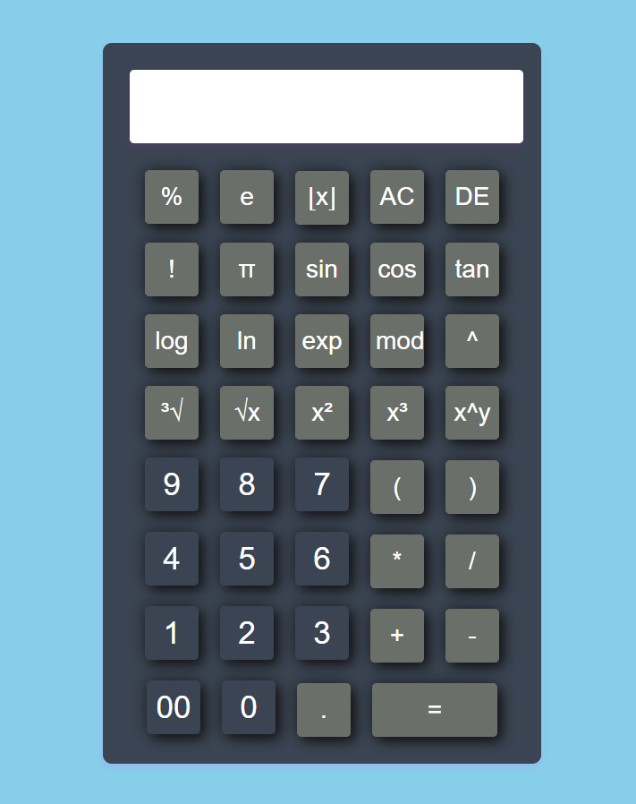

# 🧮 Advanced Calculator

**A web-based advanced calculator built with HTML, CSS, and JavaScript. It supports basic arithmetic, scientific functions, and keyboard input.**

---

## ✨ Features

- **Basic Operations:** `+`, `-`, `×`, `÷`, `%`
- **Scientific Functions:**  
  - `sin`, `cos`, `tan` (Trigonometric)
  - `log`, `ln` (Logarithmic)
  - `exp`, `e`, `π` (Exponential & Constants)
  - `x²`, `x³`, `xʸ`, `√x`, `∛x` (Powers & Roots)
  - `!` (Factorial), `⌊x⌋` (Floor)
- **Other:**  
  - `AC` (All Clear), `DE` (Delete)
  - Parentheses `(` `)`
  - Keyboard input support
  - Error handling

---

## 🖼️ Design Preview

> 

> *Modern, glassy interface with rounded buttons and soft shadows.  
> Symbols and icons are used for functions for a user-friendly experience.*

---

## 🛠️ Usage

1. **Open** `index.html` in your browser.
2. **Click** buttons or **type** using your keyboard.
3. **Press** `=` or `Enter` to calculate.

---

## ⌨️ Keyboard Shortcuts

| Key         | Action                |
|-------------|----------------------|
| 0-9, +, -, *, /, %, (, ) | Input numbers/operators |
| `Enter`     | Calculate result      |
| `Backspace` | Delete last character |
| `Escape`    | Clear screen          |

---

## 📁 Files

- `index.html` — Calculator UI & logic  
- `style.css` — Custom styles  
- `README.md` — Documentation

---

## 🖌️ Customization Ideas

- Add SVG icons for functions (e.g., π, √, sin)
- Use color highlights for operators and functions
- Add a dark/light mode toggle
- Use animated button effects

---

## 📝 Note

- Some scientific functions are inserted as JavaScript expressions (e.g., `Math.sin(...)`).  
  You may need to press `=` to evaluate them.
- The calculator uses JavaScript's `eval()` for expression evaluation.  
  Use with caution and avoid entering unsafe code.

---

## 🚀 Demo

> _

---

## 👤 Author

Suresh Shrestha

---

🔗 Symbols & Icons Used

- 🧮 Calculator
- ✨ Features
- 🖼️ Design
- 🛠️ Usage
- ⌨️ Keyboard
- 📁 Files
- 🖌️ Customization
- 🚀 Demo
- 👤 Author

